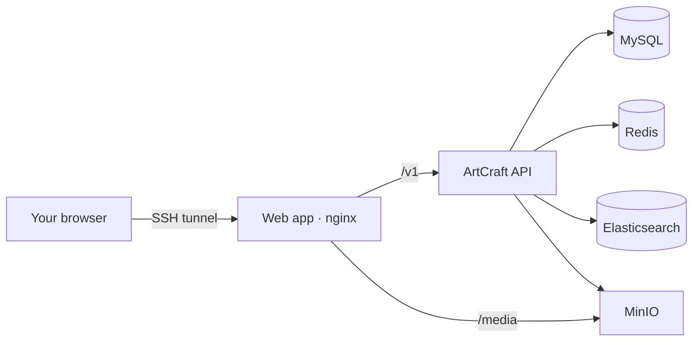

<div align="center">

# ArtCraft Personal Server

**A home for your ArtCraft files, on your own server.**

An unofficial Docker Compose setup for running the ArtCraft web app, API, and storage for personal use.

[](https://github.com/junwonkim07/artcraft-personal-server/actions/workflows/validate.yml)
[](LICENSE)
[](docs/ko/status.md)

[Quick start](#quick-start) · [Documentation](#documentation) · [Contributing](CONTRIBUTING.md) · [한국어 설치 가이드](docs/ko/install.md)

</div>

---

Bring the ArtCraft web interface and its supporting services onto a single machine. This project packages the upstream application with persistent storage, local media URLs, database setup, and backup tools. Access your server through an SSH tunnel, without exposing its database or storage services to the internet.

**Experimental:** end-to-end deployment validation is in progress. See the [verification status](docs/ko/status.md) for tested behavior and known limitations.

## What’s included

- **Web app and API** built from a pinned upstream revision.
- **Your own storage** for accounts, media metadata, and uploaded files.
- **Local media URLs** through small, build-time patches that preserve upstream defaults when unset.
- **One Compose stack** with database migrations, initial roles, and health checks.
- **Backup and restore scripts** with checksums and explicit failure handling.
- **Private access by default:** services bind to localhost or the internal Docker network.

This is a personal hosting setup, not a replacement for the hosted ArtCraft service. AI generation, payments, email delivery, indexed search, thumbnail workers, and complete editor-history synchronization are outside the current scope. Desktop integration is documented but not yet verified.

## Architecture



All application traffic stays on your server. External model providers are not configured by default. Upstream UI links and integrations remain present; this is not an offline or air-gapped build.

## Quick start

You’ll need Git, Docker Engine, and Docker Compose. For a fresh VPS, start with the [Ubuntu setup guide](docs/ko/install.md). The initial build compiles Rust, Go, and the web app; allow substantial time and disk space. Resource requirements are still being measured.

```bash
git clone https://github.com/junwonkim07/artcraft-personal-server.git
cd artcraft-personal-server

# Generate local secrets. Existing secrets are never overwritten.
./scripts/generate-secrets.sh

# Build and start the stack.
docker compose build
docker compose up -d

# Check the application and storage access policy.
./scripts/status.sh
./scripts/verify-storage-policy.sh
```

For a local installation, open **http://localhost:4201**.

For a remote server, run this on your computer and keep it connected:

```bash
ssh -N -L 4201:127.0.0.1:4201 deploy@YOUR_SERVER
```

Then open **http://localhost:4201**. Use the username you configured on your server in place of `deploy`. See [access options](docs/ko/access.md) for API and storage-console tunnels.

## Configuration

| File | Purpose |
| --- | --- |
| `.env` | Generated database credentials, session secrets, and local ports. Gitignored. |
| `config/providers.env` | Optional provider credentials. Generated empty and gitignored. |
| `config/storyteller-web.env` | Non-secret application settings. |
| `UPSTREAM.lock` | Pinned application, dependency, and build-tool versions. |

Keep the default localhost origin when using an SSH tunnel. Changing it to a public domain also requires reviewing upstream CORS, cookies, and TLS configuration; changing a port binding alone is insufficient.

MinIO Community no longer distributes the legacy container images and is no longer maintained. This template builds pinned official MinIO and client sources locally. Review the [dependency notes](LICENSE-NOTICE.md#storage-dependencies) before using it for important data.

## Everyday commands

```bash
docker compose logs -f storyteller-web   # Follow API logs
./scripts/backup.sh                       # Back up the database and files
./scripts/restore.sh backups/TIMESTAMP    # Restore a selected backup; asks for confirmation
docker compose down                      # Stop the stack and keep data volumes
```

Store a copy of backups outside the server. See [backup and recovery](docs/ko/backup-restore.md) for coverage and consistency guarantees.

## Documentation

| Guide | What you’ll find |
| --- | --- |
| [Installation](docs/ko/install.md) | Ubuntu, Docker, SSH, prerequisites, and first startup |
| [Access](docs/ko/access.md) | Local access, SSH tunnels, and desktop configuration |
| [Backup & restore](docs/ko/backup-restore.md) | Recovery steps, retention, and off-server copies |
| [Updates & removal](docs/ko/update-uninstall.md) | Upstream pins, upgrades, rollback, and cleanup |
| [Features & verification](docs/ko/status.md) | Tested behavior, limitations, and patch details |
| [Troubleshooting](docs/ko/troubleshooting.md) | Build failures, memory, storage, and port conflicts |

Detailed guides are currently in Korean. Documentation translations are welcome.

## Contributing

Bug reports, reproducible deployment fixes, and documentation improvements are welcome. Start with [CONTRIBUTING.md](CONTRIBUTING.md). Please include the upstream revision, platform, and sanitized logs when reporting a problem.

## License & attribution

The deployment template is **MIT licensed**. ArtCraft and the upstream-derived patches have a **separate ArtCraft License** with personal-use restrictions; they are not covered by this repository’s MIT license. MinIO and other dependencies retain their own licenses. Read [LICENSE-NOTICE.md](LICENSE-NOTICE.md) for the boundaries.

Built on [storytold/artcraft-services](https://github.com/storytold/artcraft-services). This is an independent community project, not affiliated with or endorsed by ArtCraft or Storyteller.
